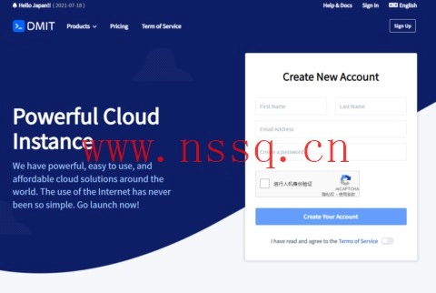

# DMIT美国CN2 GIA VPS测评：Premium系列季付$28.88起，原生IP解锁流媒体

---

最近在找靠谱的美国VPS？特别是那种晚高峰也不卡、看Netflix不用挂代理的？今天聊聊DMIT这家——他们家的Premium系列走的是CN2 GIA线路，原生美国IP，流媒体解锁能力在线。如果你正在为「选哪条线路」「IP纯净度」这些问题头疼，这篇可能有点用。

---

## DMIT到底是个什么路子？

先说结论：DMIT目前在美国洛杉矶有4个主要系列，除了Lite走普通线路，其他Premium、Premium Secure、Premium Unmetered都是CN2 GIA线路——但细分下来又有"标准GIA""高防GIA""不限流量GIA"的区别。

付款方式支持PayPal、支付宝、信用卡，国内用户买起来没门槛。

**官网地址**：https://www.dmit.io/

---

## 四大系列怎么选？一句话说清楚

### 1. **Premium系列：标准CN2 GIA**
- 基于AMD EPYC处理器
- 三网回程GIA（AS4809）
- 适合日常建站、轻量服务部署
- **季付$28.88起**

### 2. **Lite系列：普通线路（不推荐追求速度的用户）**
- 电信走163骨干网
- 联通AS4837、移动9808
- 优点是带宽大、流量多、价格便宜（月付$6.9起）
- 但**不是CN2线路**，晚高峰可能受影响

### 3. **Premium Secure：高防GIA**
- 去程由Cloudflare Magic Transit提供DDoS防护
- 三网回程依然是GIA（AS4809）
- 适合对安全性有要求的场景（比如游戏服、API服务）
- 测试IP：45.88.194.155

### 4. **Premium Unmetered：不限流量GIA**
- 同样基于AMD EPYC
- CN2 GIA线路，但**流量不计费**
- 默认配1个IPv4 + 1个IPv6
- 缺点：价格偏高，适合流量需求大的用户

> **小提示**：只有Premium和Premium Unmetered在购买时可以选择添加"Optimized GIA IP"（这是DMIT优化的混合线路IP，通过AS4134、AS4837、AS4809多路由避免CN2骨干网中断和丢包）。不是必选项，但如果你对稳定性要求极高，可以考虑加上。

---

## 为什么Premium系列值得关注？

### ✅ 原生美国IP，流媒体解锁能力强
实测可解锁Netflix、Disney+、HBO等主流平台。对于需要"干净IP"跑广告或测试海外服务的用户来说，这点很关键。

### ✅ 三网回程GIA，晚高峰也稳
不管你是电信、联通还是移动，回程都走AS4809的GIA线路。这意味着即使在晚上8-10点的流量高峰期，延迟和丢包率也能保持在可接受范围内。

### ✅ 最高2Gbps带宽计量 或 200Mbps不限流量
根据套餐不同，你可以选择"高带宽+流量包"模式，或者"中等带宽+无限流量"模式。灵活度比较高。

如果你正在考虑搭建海外节点、部署API服务或者做跨境电商测试，👉 [DMIT的Premium系列可以先试试这个链接](https://www.dmit.io/aff.php?aff=13832)，季付起步价格还算合理。

---

## 实际使用场景：哪些人适合买？

### 适合你，如果你是：
- **外贸/跨境电商从业者**：需要稳定访问海外平台（Shopify、Amazon等）
- **内容创作者/自媒体**：需要原生IP解锁流媒体做素材搜集
- **轻量建站用户**：博客、小型API服务、代理节点部署
- **对线路有要求的个人用户**：不想忍受晚高峰卡顿

### 不太适合你，如果你：
- 只是偶尔用用，对速度没啥要求（那Lite系列更便宜）
- 预算极其有限（Premium起步价还是比纯共享主机贵）
- 需要大量计算资源（VPS不如独服或云主机灵活）

---

## 总结：DMIT Premium值不值得入？

回到最开始的问题——如果你需要一台**晚高峰不掉速、IP纯净度高、流媒体解锁稳定**的美国VPS，DMIT的Premium系列确实是个靠谱选项。

特别是对于那些「试过很多家但总在关键时刻掉链子」的用户，CN2 GIA线路 + AMD EPYC处理器 + 原生IP这个组合，基本能覆盖大部分日常场景。

想了解更多细节或者直接下单？👉 [可以先从这里进去看看配置和实时库存](https://www.dmit.io/aff.php?aff=13832)，季付$28.88起的Premium系列，算是这个配置里性价比比较合理的选择了。
